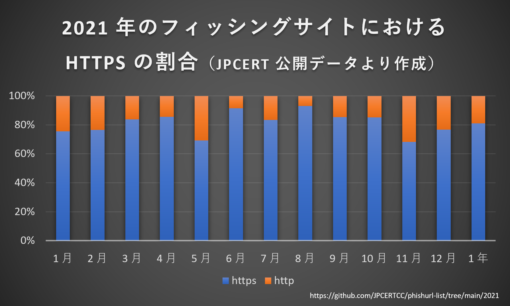
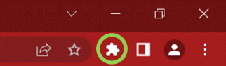

# Subliminal CertInfo

SSL 証明書を取得した組織を明示する Chrome 拡張機能

<table>
  <tr>
    <th>Icon</th>
    <th>us</th>
  </tr>
  <tr>
    <td rowspan="5" align="center">
      
    </td>
    <td>
      <a href="https://github.com/t-star08">t-star08</a>
    </td>
  </tr>
  <tr>
    <td>
      <a href="https://github.com/R4nSC">R4nSC</a>
    </td>
  </tr>
  <tr>
    <td>
      <a href="https://github.com/suzuki307">suzuki307</a>
    </td>
  </tr>
  <tr>
    <td>
      <a href="https://github.com/nRun-sm">nRun-sm</a>
    </td>
  </tr>
  <tr>
    <td>
      <a href="https://github.com/sumeshi">sumeshi</a>
    </td>
  </tr>
</table>

アイコンは AI (Stable Diffusion) を使って作成

## 目次

- [Subliminal CertInfo](#subliminal-certinfo)
  - [目次](#目次)
  - [背景](#背景)
  - [提案](#提案)
    - [SSL 証明書の種類](#ssl-証明書の種類)
    - [犯罪者の費用対効果](#犯罪者の費用対効果)
    - [OV, EV 証明書を取得している企業](#ov-ev-証明書を取得している企業)
  - [機能概要](#機能概要)
  - [インストール方法](#インストール方法)
    - [拡張機能をピン留めする](#拡張機能をピン留めする)
  - [使い方](#使い方)
  - [プライバシー](#プライバシー)
  - [参考資料](#参考資料)

## 背景

サイトが安全かどうか、または信頼できるかどうかを判断する 1 つの指標として、「HTTPS 通信ができるか」を見ている人がいる。しかし、実はフィッシングサイトでも、HTTPS 通信ができるサイトはかなり多い（参照: 図1）。

| |
| :---: |
|  |
| 図1: 2021 年のフィッシングサイトにおける HTTPS の割合（JPCERT 公開データより作成）|

図1 は JPCERT が公開している 2021 年に見つかったフィッシングサイトの HTTP と HTTPS の割合だ。2021 年を通して見つかったフィッシングサイトのうち、80% 以上のフィッシングサイトで HTTPS 通信ができたことがわかる。このことから、「フィッシングサイトは HTTPS 通信ができないから、HTTPS かどうかを見ていれば安全だろう」という考え方は危険だといえる。

## 提案

HTTPS 通信をおこなうときに必要な SSL 証明書のなかでも OV, EV 証明書をユーザの目に見えるかたちで活用する。
- OV, EV 証明書に記載された組織の名前をゼロステップで表示させる
  - OV, EV 証明書を取得している組織には一定レベル以上の信頼性がある
- ユーザの目に入る位置に自動で表示させることで、組織名を確認することの習慣化を狙う
  - 明らかにおかしい組織名が表示されたとき、フィッシングサイトの可能性を疑ってもらえるようになる
  - 日常的に表示される組織名を視角情報として定着させることで、本物の組織名に酷似する組織名が表示されたときに違和感をもってもらい、フィッシングサイトの可能性を疑ってもらえるようになる
- 表示された組織名を確認する、という簡単なステップからセキュリティ意識向上を狙う
  - いまアクセスしているサイトについての、各種脅威情報サイトへのリンクを提供することで、ステップアップの機会を作る

### SSL 証明書の種類

HTTPS 通信を可能にする SSL 証明書には主に次の 3 種類がある。
- DV(Domain Validation) 証明書
  - Web サイトの所有者の審査がおこなわれない
- OV(Organization Validation) 証明書
  - Web サイトの所有者（企業などの組織）の審査がおこなわれる
- EV(Extended Validation) 証明書
  - Web サイトの所有者（企業などの組織）の審査が **厳格** におこなわれる

このなかで、OV, EV 証明書は、Web サイトの所有者である、企業などの組織について審査がおこなわれる。OV 証明書は審査の過程で、組織が実在するか、本物の組織が申請しているか、などが確認され、EV 証明書については、この審査がより厳格におこなわれる。

### 犯罪者の費用対効果

犯罪者の立場に立てば、OV, EV 証明書を取得するためにかかる時間、資金、労力と犯罪行為によって得られる収益との費用対効果から OV, EV 証明書を取得してまで犯罪行為を働くことを躊躇う犯罪者は多くいることが考えられる。また、犯罪者が取得できる OV, EV 証明書は、実在企業に似せることはできるかもしれないが、所詮偽者に過ぎない。

### OV, EV 証明書を取得している企業

フィッシングサイトの主な目的は、ユーザを騙してアカウント情報を盗み取るところにある。そこで次の企業のログイン画面について、OV, EV 証明書を取得しているか調査した結果を次の表1 に示す（一部 URL ではクエリの問題からアクセスできないかもしれない）。

表1: OV, EV 証明書の調査結果
| 企業 | OV, EV 証明書を取得しているか |
| :--: | :--------------------------: |
| [Google](https://accounts.google.com/v3/signin/identifier?dsh=S-1274308985%3A1664700247866708&continue=https%3A%2F%2Ftakeout.google.com%2F&followup=https%3A%2F%2Ftakeout.google.com%2F&osid=1&passive=1209600&flowName=GlifWebSignIn&flowEntry=ServiceLogin&ifkv=AQDHYWqcfyPjEG1b0ppzPtGCXlRsA5yy5F7bU2BGyPSESZD4uNwdTrfKNONoU6Zli6EDo0YGwLVY-w) | × |
| [Microsoft](https://account.microsoft.com/account) | ○ |
| [Twitter](https://twitter.com/login?lang=ja) | ○ |
| [Instagram](https://www.instagram.com/accounts/login/) | ○ |
| [Amazon](https://www.amazonlogistics.jp/ap/signin?openid.pape.max_auth_age=28800&openid.return_to=https%3A%2F%2Fwww.amazonlogistics.jp%2F&suppressChangeEmailLink=1&openid.identity=http%3A%2F%2Fspecs.openid.net%2Fauth%2F2.0%2Fidentifier_select&openid.assoc_handle=amazonlogistics_fe&openid.mode=checkid_setup&openid.claimed_id=http%3A%2F%2Fspecs.openid.net%2Fauth%2F2.0%2Fidentifier_select&openid.ns=http%3A%2F%2Fspecs.openid.net%2Fauth%2F2.0&suppressSignInRadioButtons=1) | × |
| [Yahoo](https://login.yahoo.co.jp/config/login) | ○ |
| [楽天市場](https://grp01.id.rakuten.co.jp/rms/nid/vc?__event=login&service_id=top) | ○ |
| [三菱銀行](https://entry11.bk.mufg.jp/ibg/dfw/APLIN/loginib/login?_TRANID=AA000_001) | ○ |
| [三井住友銀行](https://direct.smbc.co.jp/aib/aibgsjsw5001.jsp) | ○ |
| [みずほ銀行](https://web.ib.mizuhobank.co.jp/servlet/LOGBNK0000000B.do) | ○ |
| [ゆうちょ銀行](https://direct.jp-bank.japanpost.jp/tp1web/U010101WAK.do) | ○ |
| [クロネコヤマト](https://auth.kms.kuronekoyamato.co.jp/auth/login) | ○ |
| [佐川急便](https://www.e-service.sagawa-exp.co.jp/auth/realms/sc/protocol/openid-connect/auth?response_type=code&scope=openid&client_id=sagawa-exp.co.jp&state=y-pRuzdvy_28hG4ABKEJ1cky3Cw&redirect_uri=https%3A%2F%2Fwww.e-service.sagawa-exp.co.jp%2Fredirect%2Fredirect_uri&nonce=vSACUHvSggVbJpq9WcF_c3saZHDj1EkJBgXqAsTnpwE) | ○ |
| [日本郵便](https://login.post.japanpost.jp/aew/page/portalLogin) | ○ |
| [NTT ドコモ](https://cfg.smt.docomo.ne.jp/auth/cgi/anidlogin) | ○ |
| [SoftBank](https://id.my.softbank.jp/sbid_auth/type1/2.0/authorization.php?response_type=code&client_id=o00aXYC6xABycFsvzmgFARqc0oa1nCau&redirect_uri=https%3A%2F%2Fmy.softbank.jp%2Fmsb%2Fd%2Fauth%2FdoReceiveSbid&display=touch&prompt=login%20consent&scope=openid&nonce=20221002174534189eqNZi1AVzqwXo6I&ui_locales=ja&weblinkid=MSB020063&acr_value=1&amr=me) | ○ |
| [au](https://connect.auone.jp/net/vwc/cca_lg_eu_nets/login?targeturl=https%3A%2F%2Fmy.au.com%2Faus%2Fhc-cs%2Flic%2FLIC0020001.hc&func=LGN0004) | ○ |

## 機能概要

次の機能を実装している。

<ul>
  <li>アクセスしているサイトの SSL 証明書を調べて、OV, EV 証明書に記載された組織名を画面に表示する
    <ul>
      <li>組織名を確認できない場合、注意を喚起する</li>
    </ul>
  </li>
  <li>アクセスしているサイトについて、各種脅威情報サイトへのリンクを提示する</li>
</ul>

## インストール方法

<ol>
  <li>Subliminal CertInfo をダウンロードする
    <ul>
      <li><code>git clone git@github.com:jinkaiNitamago2022/subliminal-certinfo.git</code></li>
      <li><a href="">main ブランチの zip ファイル</a> をダウンロードする（リンクにアクセスするとダウンロードが始まります）</li>
    </ul>
  </li>
  <li><a href="chrome://extensions">chrome://extensions</a> にアクセスする</li>
  <li>右上の「デベロッパーモード」をオンにする（図2）
    <table>
      <tr align="center">
        <td>
          
        </td>
      </tr>
      <tr align="center">
        <td>
          図2: 「デベロッパーモード」のオン・オフを選択する場所（図では「オン」になっている）
        </td>
      </tr>
    </table>
  </li>
  <li>「パッケージ化されていない拡張機能を読み込む」を選択する（図3）
    <table>
      <tr align="center">
        <td>
          
        </td>
      </tr>
      <tr align="center">
        <td>
          図3: 「パッケージ化されていない拡張機能を読み込む」を選択する場所
        </td>
      </tr>
    </table>
  </li>
  <li>1. でダウンロード先として指定したディレクトリを選択する</li>
</ol>

### 拡張機能をピン留めする

拡張機能をピン留めすることで、簡単にポップアップを表示することができる

<ol>
  <li>URL バーの右側の「拡張機能のロゴ」を選択（図4）
    <table>
      <tr align="center">
        <td>
          
        </td>
      </tr>
      <tr align="center">
        <td>
          図4: 「拡張機能のロゴ」の場所（緑色の丸で囲まれたロゴ）
        </td>
      </tr>
    </table>
  </li>
  <li>表示された拡張機能のなかから、<code>subliminal-certinfo</code> をみつける</li>
  <li>ピン留めのアイコンからピン留めする</li>
  <li>「拡張機能のロゴ」の左側に 図5 のようなアイコンが表示される
    <table>
      <tr align="center">
        <td>
          
        </td>
      </tr>
      <tr align="center">
        <td>
          図5: <code>subliminal-certinfo</code> のアイコン
        </td>
      </tr>
    </table>
  </li>
</ol>

## 使い方

主な使い方は次の 2 通り

<ol>
  <li>サイトアクセス時に左上に表示される「サイトを提供している組織の名前」を確認する（図6, 図7）。このとき、図7 のように表示された場合は組織名を確認できなかったことを意味をするため、個人情報などを入力する前にサイトの信頼性を確認することを勧める。調べる際にはポップアップのリンクを活用できる（詳しくは 2. で説明）。
    <table>
      <tr align="center">
        <td>
          
        </td>
      </tr>
      <tr align="center">
        <td>
          図6: 組織の名前を確認できたときの画面表示
        </td>
      </tr>
      <tr align="center">
        <td>
          
        </td>
      </tr>
      <tr align="center">
        <td>
          図7: 組織名を確認できなかったときの画面表示
        </td>
    </table>
  </li>
  <li>ポップアップを表示して、
    <ul>
      <li>「サイトを提供している組織の名前」を確認する（図8, 図9）</li>
      <li>アクセスしているサイトについての各種脅威情報サイトへのリンクから、サイトの危険性を調べる（図8, 図9）</li>
    </ul>
    <table>
      <tr align="center">
        <td>
          
        </td>
      </tr>
      <tr align="center">
        <td>
          図8: 組織の名前を確認できたあとに表示したポップアップ
        </td>
      </tr>
      <tr align="center">
        <td>
          
        </td>
      </tr>
      <tr align="center">
        <td>
          図9: 組織の名前を確認できたあとに表示したポップアップ
        </td>
      </tr>
    </table>
  </li>
</ol>

## プライバシー

- この Chrome 拡張機能は、アクセスしているサイトの SSL 証明書を調べるために、次の場合にサイトのドメインを外部に用意したサーバに送信します。
  - アクセスしているサイトのドメインが変わったとき
  - タブが変わったとき
- ドメインとはたとえば、`https://github.com/jinkaiNitamago2022/subliminal-certinfo` では、`github.com` を指します。
- 私たちは送信されたドメインの再利用をおこないません。

## 参考資料

- JPCERT, Phishing URL dataset from JPCERT/CC, 2022/08/12, https://github.com/JPCERTCC/phishurl-list/, 2022/10/02
- digicert, DV、OV、EVの 各 SSL 証明書の違いとは？, "-", https://www.digicert.com/jp/difference-between-dv-ov-and-ev-ssl-certificates, 2022/10/02
- SAKURA internet, 改めて知ろう、SSLサーバー証明書とは？（第二回）, 2019/06/13, https://knowledge.sakura.ad.jp/2988/, 2022/10/02
